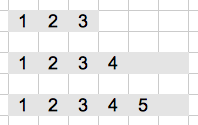
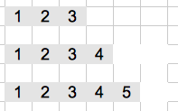

## 結果1

```{r append1, dependson=c("appendR", "appendCpp")}
benchmark(replications=10, 
  r1 <- f.R1(10^4),
  r2 <- f.Cpp1(10^4)
  )
all.equal(r1, r2)
```

--- &twocol

## Time Complexity

*** =left

### STL



$$1 + 2 + 4 + ... + 2^m = 2^{m + 1} - 1 = O(n)$$

ps. $2^m < n$

*** =right

### R



$$1 + 2 + ... + n = O(n^2)$$

--- &twocol

## 在Appending資料的時候，能先設定長度可大幅加速

*** =left

```{r appendR2, cache = TRUE}
library(rbenchmark)
f.R2 <-  function(n) {
  a <- integer(n)
  for(i in 1:n) {
    a[i] <- i
  }
  a
}
```

*** =right

```{r appendCpp2, engine='Rcpp', cache=FALSE}
#include <Rcpp.h>

using namespace Rcpp;

//[[Rcpp::export("f.Cpp2")]]
std::vector<int> f_Cpp1(int n) {
  std::vector<int> v(n);
  for(int i = 1;i <= n;i++) {
    v[i] = i;
  }
  return v;
}
```

---

## 結果2

```{r append2, dependson=c("appendR", "appendCpp", "appendR2", "appendCpp2")}
benchmark(replications=10, 
  r1 <- f.R1(10^4),
  r2 <- f.Cpp1(10^4),
  r3 <- f.R2(10^4),
  r4 <- f.Cpp2(10^4)
  )
all.equal(r1, r2)
all.equal(r1, r3)
all.equal(r1, r4)
```

--- 

## 結果3

```{r append3, dependson=c("appendCpp", "appendCpp2")}
benchmark(replications=10, 
  r2 <- f.Cpp1(10^6),
  r4 <- f.Cpp2(10^6)
  )
all.equal(r2, r4)
```

--- 

## Template Class

```{r stlrcpp, echo=FALSE, results='asis'}
suppressPackageStartupMessages(library(xtable))
df <- data.frame(
  "STL" = c("std::vector<int>", "std::vector<double>", "std::vector<bool>"),
  "Rcpp" = c("typedef Vector<INTSXP> Rcpp::NumericVector", "typedef Vector<REALSXP> Rcpp::NumericVector", "typedef Vector<LGLSXP> Rcpp::NumericVector")
  )
rownames(df) <- c("int", "double", "bool")
print.xtable(xtable(df), type="html")
```

### `REALSXP`, `INTSXP`, `LGLSXP`

<http://docs.rexamine.com/R-devel/Rinternals_8h_source.html#l00109>

```c
...
#define LGLSXP 10 /* logical vectors */
/* 11 and 12 were factors and ordered factors in the 1990s */
#define INTSXP 13 /* integer vectors */
#define REALSXP 14 /* real variables */
...
```

--- &vcenter

## 修改Vector

### `operator::[]`

```{r modify1, engine='Rcpp'}
#include <Rcpp.h>
using namespace Rcpp;
//[[Rcpp::export]]
SEXP modify(IntegerVector x, int i) {
  x(i) = 0;
  return x;
}
/*** R
x <- y <- 1:10
invisible(modify(x, 5))
x
y
*/
```


### Iterator

```{r modify2, engine='Rcpp'}
#include <Rcpp.h>
using namespace Rcpp;
//[[Rcpp::export]]
SEXP modify(IntegerVector x, int i) {
  IntegerVector::iterator j = x.begin() + i;
  *j = 0;
  return x;
}
/*** R
x <- 1:10
modify(x, 5)
x
*/
```

