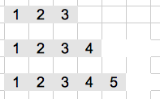

## 結果1


```r
benchmark(replications=10, 
  r1 <- f.R1(10^4),
  r2 <- f.Cpp1(10^4)
  )
```

```
##                 test replications elapsed relative user.self sys.self
## 1   r1 <- f.R1(10^4)           10   1.738     1738     1.731    0.007
## 2 r2 <- f.Cpp1(10^4)           10   0.001        1     0.001    0.000
##   user.child sys.child
## 1          0         0
## 2          0         0
```

```r
all.equal(r1, r2)
```

```
## [1] TRUE
```

--- &twocol

## Time Complexity

*** =left

### STL


$$1 + 2 + 4 + ... + 2^m = 2^{m + 1} - 1 = O(n)$$

ps. $2^m < n$

*** =right

### R



$$1 + 2 + ... + n = O(n^2)$$

--- &twocol

## 在Appending資料的時候，能先設定長度可大幅加速

*** =left


```r
library(rbenchmark)
f.R2 <-  function(n) {
  a <- integer(n)
  for(i in 1:n) {
    a[i] <- i
  }
  a
}
```

*** =right


```cpp
#include <Rcpp.h>

using namespace Rcpp;

//[[Rcpp::export("f.Cpp2")]]
std::vector<int> f_Cpp1(int n) {
  std::vector<int> v(n);
  for(int i = 1;i <= n;i++) {
    v[i] = i;
  }
  return v;
}
```

---

## 結果2


```r
benchmark(replications=10, 
  r1 <- f.R1(10^4),
  r2 <- f.Cpp1(10^4),
  r3 <- f.R2(10^4),
  r4 <- f.Cpp2(10^4)
  )
```

```
##                 test replications elapsed relative user.self sys.self
## 1   r1 <- f.R1(10^4)           10   1.682     1682     1.678    0.003
## 2 r2 <- f.Cpp1(10^4)           10   0.001        1     0.001    0.000
## 3   r3 <- f.R2(10^4)           10   0.076       76     0.072    0.004
## 4 r4 <- f.Cpp2(10^4)           10   0.001        1     0.001    0.000
##   user.child sys.child
## 1          0         0
## 2          0         0
## 3          0         0
## 4          0         0
```

```r
all.equal(r1, r2)
```

```
## [1] TRUE
```

```r
all.equal(r1, r3)
```

```
## [1] TRUE
```

```r
all.equal(r1, r4)
```

```
## [1] "Mean relative difference: 2e-04"
```

--- 

## 結果3


```r
benchmark(replications=10, 
  r2 <- f.Cpp1(10^6),
  r4 <- f.Cpp2(10^6)
  )
```

```
##                 test replications elapsed relative user.self sys.self
## 1 r2 <- f.Cpp1(10^6)           10   0.154    1.525     0.141    0.013
## 2 r4 <- f.Cpp2(10^6)           10   0.101    1.000     0.089    0.011
##   user.child sys.child
## 1          0         0
## 2          0         0
```

```r
all.equal(r2, r4)
```

```
## [1] "Mean relative difference: 2e-06"
```

--- 

## Template Class

<!-- html table generated in R 3.1.0 by xtable 1.7-3 package -->
<!-- Wed Jul  2 20:27:11 2014 -->
<TABLE border=1>
<TR> <TH>  </TH> <TH> STL </TH> <TH> Rcpp </TH>  </TR>
  <TR> <TD align="right"> int </TD> <TD> std::vector&lt;int&gt; </TD> <TD> typedef Vector&lt;INTSXP&gt; Rcpp::NumericVector </TD> </TR>
  <TR> <TD align="right"> double </TD> <TD> std::vector&lt;double&gt; </TD> <TD> typedef Vector&lt;REALSXP&gt; Rcpp::NumericVector </TD> </TR>
  <TR> <TD align="right"> bool </TD> <TD> std::vector&lt;bool&gt; </TD> <TD> typedef Vector&lt;LGLSXP&gt; Rcpp::NumericVector </TD> </TR>
   </TABLE>

### `REALSXP`, `INTSXP`, `LGLSXP`

<http://docs.rexamine.com/R-devel/Rinternals_8h_source.html#l00109>

```c
...
#define LGLSXP 10 /* logical vectors */
/* 11 and 12 were factors and ordered factors in the 1990s */
#define INTSXP 13 /* integer vectors */
#define REALSXP 14 /* real variables */
...
```

--- &vcenter

## 修改Vector

### `operator::[]`


```cpp
#include <Rcpp.h>
using namespace Rcpp;
//[[Rcpp::export]]
SEXP modify(IntegerVector x, int i) {
  x(i) = 0;
  return x;
}
/*** R
x <- y <- 1:10
invisible(modify(x, 5))
x
y
*/
```


### Iterator


```cpp
#include <Rcpp.h>
using namespace Rcpp;
//[[Rcpp::export]]
SEXP modify(IntegerVector x, int i) {
  IntegerVector::iterator j = x.begin() + i;
  *j = 0;
  return x;
}
/*** R
x <- 1:10
modify(x, 5)
x
*/
```

